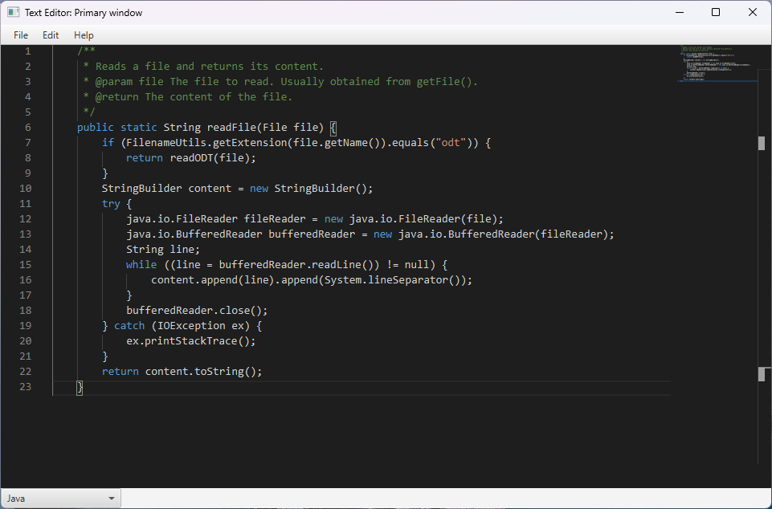

# TextEditorJava

Made for Massey University assignment in 2022

To run the program use the maven goal javafx:run found under Maven -> Plugins -> javafx -> javafx:run

Uses JavaFX 18 for GUI, ODFDOM for .odt reading, and MonacoFX for editing. GitHub Actions compiles and tests with Junit on pushes and pull requests to main branch.
config.yaml found in the java resources folder can change attributes of the editor depending on whether you are editing code or plain text files. 
Language is auto-detected when opening files or can be manually selected. 
The editor also warns when you have unsaved changes. 
Supports printing to real printers or to PDF file.
